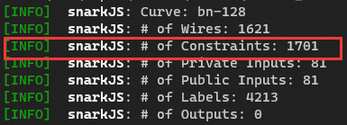

# circom_demo
some circuit demo,develop by circom 2.1.x

## Makefile

首先需要编写好对应的电路文件，然后**需要修改Makefile中circom电路的文件名及其派生文件的文件名，使其与你的circom文件名`circuit_name`一致**

新建一个文件夹并命名为`circuit_name_input`，将电路的输入文件放入该文件夹内，输入文件命名为`circuit_name.input.json`

**在执行makefle之前，需要先用下列命令检查你的电路约束数量**

> snarkjs ri circuit.r1cs

然后检查makefile文件，确保power参数与电路约束数量满足下列等式（make文件中默认写的是11，也即电路中约束数量最大为2048个）

$$
2^{power} \le Constraints
$$

make文件用于windows平台，Linux平台需要将最后的`del`命令修改为`rm -f`，其余命令可自行修改

## Notes
1. circomlib的SHA256模板中，sha256_2中好像有点问题，输入要求是长度为216 bits的串，不是很理解为什么这样写（为什么不是256 bits），可以考虑使用Poseidon Hash
2. 部分电路中有关于input的说明文件`README.md`，测试时请先阅读对应说明文件

## Task List
1. ~~[Done] 数独电路（Sudoku）~~
2. ~~[Done] 验证身份证正确性（仅验证校验位是否合法）（misc\inChecker）~~
3. ~~[Done] 哈密顿回路（Hamiltonian_Cycle）~~
4. ~~[Done] 图的三着色问题（3Colors）~~
5. ~~[Done] 迭代计算Hash - SHA256（Iteration_Hashing）~~
6. ~~[Done] 迭代计算Hash - Poseidon（Iteration_Poseidon）~~
7. [On-Hold] Ascon(NIST version)的circom实现
8. [Ongoing] 国密SM2/3/4算法的circom实现
9. [Todo] 祖冲之算法的circom实现
10. [Todo] AES算法的circom实现

## Warning
1. Iteration_Hashing.circom中采用的Hash算法为SHA256，由于SHA256中的约束条件非常多，因此电路的迭代次数（n值）不宜设置的过大，否则会因为内存不足导致无法完成电路编译，经测试，n=10与n=30时的最大内存开销分别约为1GB与5GB，请谨慎设置迭代次数（内存足够请忽略本警告）
2. Iteration_Poseidon.circom中将SHA256替换成更适合ZKP系统的Poseidon Hash，经测试，当迭代次数（n值）为1000时，电路编译时的峰值内存开销约为1GB，此时得到的约束数量在$10^5$数量级，优于上述SHA256的方案，适用于迭代次数较大的证明

## Others

1. makefile文件中的contribute命令中的random text和beacon命令中的随机信标值可以随意修改，命令的执行次数也可以随意添加或删除
2. node命令执行失败通常意味着input文件中的输入不满足约束条件（此时会报错），要么修改电路中的约束条件，要么修改input中对应的输入
3. power参数不宜设置过大，因为`phase2`命令会占据大量CPU（执行该命令后CPU利用率基本会维持在99%以上，直至计算完毕），power越大意味着计算时间越久，因此需要将该参数设置为最接近约束数量的值
4. 如果需要查看中间结果，则把最后的del命令删除
5. 计算beacon中的hash_power也不宜设置过大，否则也会导致计算过慢，计算公式为$time = 2^{hash_power}$，Makefile中默认设置hash_power=10，有需要可自行更改

